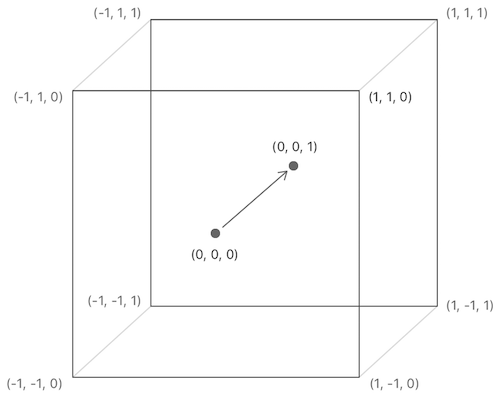
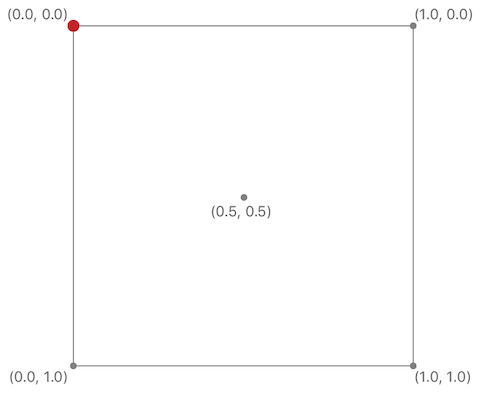
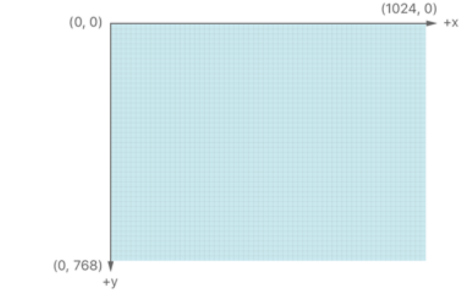
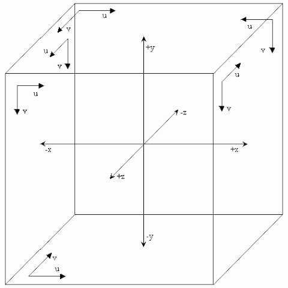

# Exploring Cubemapping with Metal Shaders

This project consists of 4 Demos which involve the setting up of a cubic environment map.

<br />
<br />
<br />

**Demo 1: Cubemapping.** 

It applies the concept of layer rendering in Metal to create a cube texture which will be displayed as a background environment map.

Metal applications have 2 other ways of creating a cube map texture. One method is to instantiate six instances of 2D MTLTexture from 6 graphic images. The MTLTextureDescriptor class function is then called

```swift
        textureCubeDescriptor(pixelFormat:, size:, mipmapped:)
```
to create a 3D cube MTLTexture. The pixels of the six 2D MTLTextures are copied to 6 slices of the 3D cube MTLTexture.


Another method is to call the MTLTextureLoader function:

```swift
	newTexture(name:, scaleFactor:, bundle:, options:)
```

to load the 6 images to instantiate the cubemap texture. These 6 images are placed in a cubetexture set within the application's Assets.xcassets folder. However, this approach means 16-bit *.hdr* images files cannot used to instantiate a cubemap texture.

(See Apple's "LODwithFunctionSpecialization" or "Deferred Lighting" demo.)

Once the cubemap texture is created, it can be applied to a skybox or used to texture the 6 faces of a box.

This demo will also perform a simulation of a reflection of the environment. 


Details on creating a cube map using layer rendering in Metal

<br />

The cubemap texture is created using the following procedure:

a) Six square graphic images are loaded and instantiated as NSImage objects. An array of 6 CGImages are created from these NSImage instances.

b) They are converted into instances of MTLTextures (type2D) using the MTKTextureLoader function

```swift
	newTexture(cgImage:, options:)
```

c) The MTLRenderPassDescriptor and MTLRenderPipelineDescriptor objects of an offscreen renderer are setup. To apply the idea of layer rendering in Metal, the renderTargetArrayLength property of the MTLRenderPassDescriptor object is set to 6. Any value more than 0 will enable layer rendering. The inputPrimitiveTopology property of the MTLRenderPipelineDescriptor object must be set to "MTLPrimitiveTopologyClass.triangle" since layered rendering is enabled.

d) The 6 slices of the cube map are then rendered during a render pass using a MTLRenderCommandEncoder object. Refer to the function "createCubemapTexture".


For best performance during rendering to screen, the cubemap texture should be created before entering the main display loop.


Once the cubemap texture is created, a second MTLRenderCommandEncoder object uses it to draw a skybox.

A third MTLRenderCommandEncoder object uses the cubemap texture to simulate a reflection of the environment as displayed by the skybox.

Both the second and third render passes are executed within the main display loop.

<br />
<br />
<br />

**Demo 2: Convert six 2D Cubic environment maps to an EquiRectangular map.**

This demo loads and instantiates a MTLTexture of type MTLTextureTypeCube from 6 *.hdr* files located in the *Images* folder of this project. Two sets of *.hdr* files are provided; the sets have been converted from the files *equirectImage.hdr* and *newport_loft.hdr*.

An offscreen renderer *createEquiRectangularTexture* is called to convert the six 2D faces of the cubemap texture to a 2:1 EquiRectangular texture.

Finally, within the main rendering loop, even though the dimensions of the the generated EquiRectangular texture is 2:1, we still render the geometry of a 1:1 square. It is not necessary to scale the geometry of the quad to fit Metal's [2,2,1] NDC (normalised device coordinates) box.  

The texture output by the fragment function *outputEquiRectangularTexture* can be saved to disk by pressing an *s*/*S* key. To output the EquiRectangular texture as a 2:1 image, an Affine transformation is performed on the generated 2:1 texture.

Note: the previous iteration of this demo uses a special function to load hdr. The EquiRectangular map was saved in HEIC format. Currently, this demo calls 2 C functions viz. *stbi_loadf* and *stbi_write_hdr* from the stb_image (header) library to load and save the *.hdr* images.

<br />
<br />
<br />

**Demo 3: Convert an EquiRectangular image to six 2D images.**

This demo converts an EquiRectangular image (2:1) to six 2D images by rendering to an off-screen cubemap texture (MTLTextureTypeCube) using the Left Hand Rule (LHS).

Once the view is displayed, the user may save the six 2D images generated by this Metal application to disk by pressing "s" or "S". He/she can visually compare the six 2D images (*.hdr*) with those within the "Images" folder of this project. The images within this folder were obtained by running the WebGL program at the link:

https://matheowis.github.io/HDRI-to-CubeMap/


Due the differences between the coordinate systems of Metal and OpenGL, some minor modifications to the original fragment shader code is necessary. For instance, the 2D texture coordinate system in Metal is as follows:

- origin: top left hand corner of the 2x2 quad with
-   the u-axis: horizontally from left to right, and,
-   the v-axis: vertically from top to bottom.


In OpenGL, the texture coordinate system is:

- origin: lower left hand corner of the 2x2 quad with
-   the u-axis: horizontally from left to right, and,
-   the v-axis: vertically from bottom to top.


The code of the following Metal Shader function is a port of a working OpenGL fragment shader function.

```metal
    float2 sampleSphericalMap(float3 direction) {

        // Original code:
        //      tan(θ) = dir.z/dir.x and sin(φ) = dir.y/1.0
        float2 uv = float2(atan2(direction.x, direction.z),
                           asin(-direction.y));

        // The range of uv.x: [ -π,   π ] --> [-0.5, 0.5]
        // The range of uv.y: [-π/2, π/2] --> [-0.5, 0.5]
        uv *= invAtan;
        uv += 0.5;          // [0, 1] for both uv.x & uv.y

        return uv;
    }

```

XCode 9.x running on macOS 10.13.x has a *Metal Frame Debugger* which can be used to capture a frame.


Using the *Metal Frame Debugger*, it is observed the order of output 2D textures of the cubemap is correct; the images are not flipped horizontally nor vertically. This is the expected output.


<br />
<br />
<br />

**Demo 4: Convert an EquiRectangular image to six 2D images.**

Instead of using the Left Hand Rule to instantiate the cubemap texture, the Right Hand Rule is applied.

Notice that the fragment shader function *sampleSphericalMap* is the same as Demo 3.  Using the *Metal Framer Debugger*, the order of the six textures of the cubemap is correct. But the textures are flipped horizontally. If you compare the rendered cubemap texture as view from within the skybox, you would notice that the order of the faces are not correct for this Demo. For instance, the "Left" face is on the right of the "Front" face for Demo 4 whereas it is the left of the latter for Demo 3. 

If we add the statement:
```metal
    uv.x = 1.0 - uv.x;
```
just before the return statement, the textures of +X and -X faces are swapped when viewed with the *Metal Frame Debugger*. The output is -X, +X, +Y, -Y, +Z and -Z and the 6 textures are not flipped horizontally nor vertically. On the other hand, when viewed from within the skybox, the textures of the 6 faces are flipped horizontally. You should run Demo 3 and Demo 4 together under XCode to note the difference. See the **Notes** section below for a clearer explanation. 

<br />
<br />
<br />


**Notes:**

Capturing a standard cubemap consisting of six 2D textures from a single 2D image (e.g. EquiRectangular images, Horizontal/Vertical Crossmaps images etc.) requires a virtual camera to be positioned at the centre of a 2x2x2 cube. The camera is axes-aligned along the 3 Cartesian coordinate axes viz. x-axis, y-axis and z-axis. Each face is named by the positive or negative x-, y-, or z-axis that pierces the centre of its face. For example, if the positive z-axis intersects the centre of a cube face then that face is labelled the +Z face.

To better understand how to convert an equirectangular map into six 2D textures, we need to understand Metal's coordinate systems. First of, Metal adopts the Left Hand Coordinate System (LHS) for 3D rendering.


A Metal vertex shader will scale (normalise) all geometries it receives so that any model being rendered to the display fits inside a 2x2x1 box (called an NDC box). Usually the scaling is done by transforming the positions of the vertices of the model through matrix-vector multiplications. If after scaling, the positions are not in the ranges [-1.0, 1.0] for the x- and y-coordinates and [0.0, 1.0] for the z-coordinate, either part of the model or the entire model will not be rendered to the window display. This is known as clipping. It is important to note that the transformation matrices created must be consistent with the 3D coordinate system adopted, which in Metal's case, is the LHS.

As shown in the figure below, the origin of Normalized Device Coordinate System is at the centre of the box. Unlike OpenGL whose NDC box has (0.0, 0.0, 0.0) as its centre/origin, the centre of Metal's NDC box is at (0.0, 0.0, 0.5). The origin is at the centre of the -Z face. It is important to note the point (-1.0, -1.0, 0.0) is at the bottom left corner of the box with the y-axis pointing upwards. The positive direction of the z-axis is into the screen and the positive direction of the x-axis is to the right. Together the 3 axes formed the left-hand coordinate system (LHS). 





Metal's 2D texture coordinate system has its origin (0, 0) at the top-left corner with its u-axis pointing horizontally to the right and the v-axis pointing vertically downwards.  (See the figure below).





In addition, the origin of its view port coordinates starts at the top left corner with its x-axis pointing right and y-axis pointing down as shown in the figure below.




All modern graphics cards adopt the Renderman specification for cubemaps. The origin of each of the six 2D textures of the cubemap texture is at the top-left corner with their u-axis pointing horizontally to the right and the v-axis pointing vertically downwards. Looking at the figure below, the 3D coordinate system (outside of the cube) is a right- handed coordinate system (RHS) but inside the cube, the 3D coordinate system is left-handed (LHS). 





Unlike 2D textures, cubemap textures are accessed using a direction vector. The easiest way is to use the *interpolated* position of a point of a face of the cube as the 3D direction vector. 

Skyboxes are in a left-handed coordinate system because the observer or camera is inside the box. So if you’re providing a vector direction from a right-handed system (RHS), it will be “backwards” in some axis. In short, when converting an equirectangular map into six 2D textures, the vector direction should be from a LHS.

Suppose the initial position of the camera is pointing at the +Z face. If we call this direction the *forward vector* of the camera, then there are two possible positions for the camera's *up vector* which is either along the positive or negative y-axis of Metal's 3D coordinate system (LHS). In order to determine which direction should be the camera's *up vector*, it follows from the above information, it should be along the +y direction. The rendered 2D texture would be captured as an upside down image. To capture the textures of the +Y and -Y faces, the camera must be rotated about the x-axis which is positive to the right of the *forward vector*. To capture the textures of the +X, -X and -Z faces, it must be rotated about the positive y-axis.


<br />
<br />

Thanks to the authors who had posted the articles and graphics on the Internet.

<br />
<br />

**Requirements:** XCode 9.x, Swift 4.x and macOS 10.13.4 or later.
<br />
<br />

**References:**

https://learnopengl.com/PBR/IBL/Diffuse-irradiance

http://paulbourke.net/panorama/cubemaps/index.html

https://metalbyexample.com

https://stackoverflow.com/questions/58702023/what-is-the-coordinate-system-used-in-metal

    "What is the coordinate system used in metal?"

https://matheowis.github.io/HDRI-to-CubeMap/

https://renderman.pixar.com/resources/RenderMan_20/insideOutside.html


